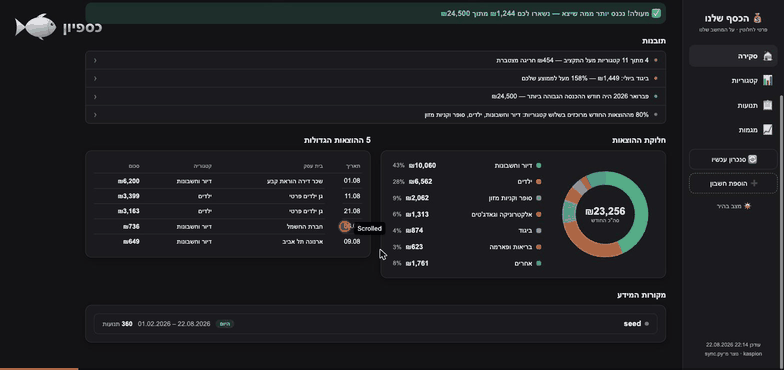
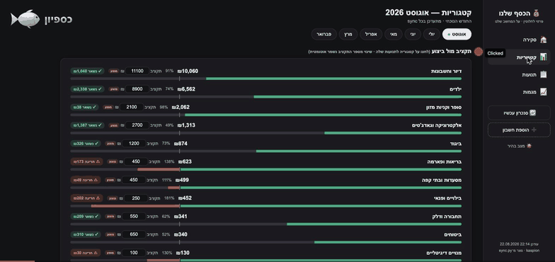
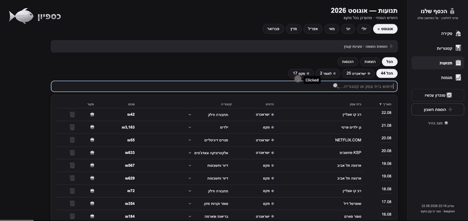
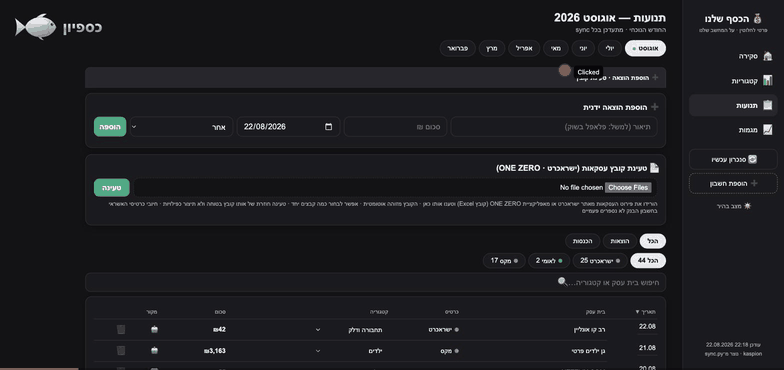
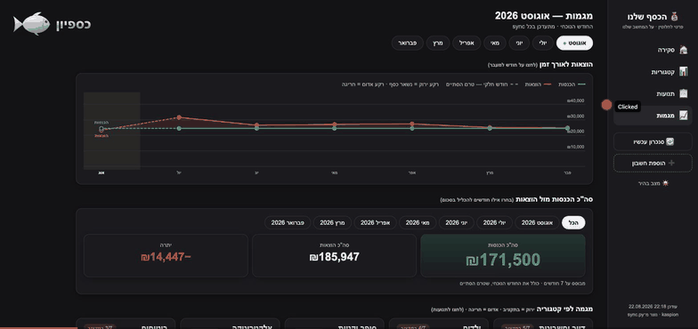
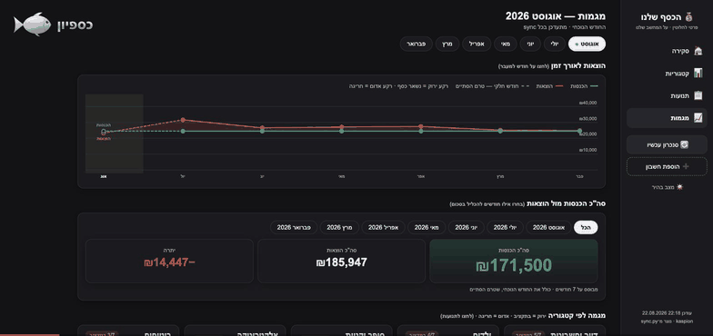

# כספיון — סיור מודרך 💰

כל מה שאפשר לעשות עם כספיון, בשישה קטעים קצרים. ההקלטות נעשו על **נתוני דוגמה
סינתטיים** — לא נתונים אמיתיים של אף אחד.

רוצים לשלוח את זה למישהו בוואטסאפ? יש גם **[סרטון אחד](kaspion-tutorial.mp4)**
עם כל השישה ברצף — מורידים אותו ושולחים כקובץ וידאו רגיל.

להתקנה: **[INSTALL.md](../../INSTALL.md)**. אחרי ההתקנה — לחיצה כפולה על `kaspion`
פותחת בדיוק את המסך שרואים כאן.

---

## 1. סקירה — לאן הכסף הולך החודש

הכנסות, הוצאות וכמה נשאר; תובנות בעברית שמחושבות מהנתונים עצמם (לא נכתבות על ידי
מודל); חלוקת ההוצאות לקטגוריות; וכפתורי החודשים למעלה — לחיצה על חודש מציגה את כולו.

---

## 2. קטגוריות — תקציב מול ביצוע

לכל קטגוריה שדה תקציב שאפשר פשוט להקליד בו. הפס מראה איפה אתם עומדים **ביחס לקצב
החודש**, לא רק בסוף החודש: ירוק = בתקציב, אדום = חריגה. בתחתית העמוד אפשר להוסיף
קטגוריה משלכם.

---

## 3. תנועות — חיפוש, סינון ותיקון קטגוריה

חיפוש חופשי לפי בית עסק או קטגוריה, סינון לפי כרטיס, והדבר החשוב: שינוי קטגוריה
מהתפריט הנפתח. **התיקון נשמר לתמיד** — הסימון ✅ אומר "אני קבעתי את זה", וכל תנועה
עתידית של אותו בית עסק תקבל את הקטגוריה שבחרתם, בלי לשאול שוב.

---

## 4. הוספת הוצאה וטעינת קובץ

הוצאה במזומן נוספת ידנית בשורה אחת, מהמסך **תנועות**. בנקים שאי אפשר לגרד אוטומטית
(ישראכרט, ONE ZERO) — מורידים מהאתר שלהם קובץ Excel וטוענים אותו בכפתור
**📄 טעינת קובץ** שבתפריט הצדדי (אפשר לגרור את הקובץ לחלון). **הבנק מזוהה מתוך הקובץ
עצמו**, וטעינה חוזרת של אותו קובץ לא תיצור כפילויות.

> ה‑GIF כאן צולם כשהטעינה עוד ישבה במסך **תנועות** — התוכן זהה, רק הכפתור עבר לתפריט.

---

## 5. מגמות — התמונה לאורך זמן

הכנסות מול הוצאות לאורך החודשים, גרף לכל קטגוריה מול היעד שלה, קצב ההוצאה בתוך
החודש, חלוקה לפי כרטיס, ולאן הלך הכסף בסך הכול.

---

## 6. חיבור חשבון וסנכרון

**➕ הוספת חשבון** — בוחרים מוסד, ממלאים את פרטי ההתחברות, וזהו. הפרטים מוצפנים
ונשמרים על המחשב הזה בלבד. מוסדות שמסומנים 🔒 דורשים טעינת קובץ במקום (ראו סעיף 4).
**🔄 סנכרון עכשיו** מושך תנועות חדשות, בונה מחדש את הנתונים ומרענן את הדף. בסוף —
מעבר בין מצב כהה לבהיר.

---

הנתונים לא יוצאים מהמחשב. המחשב מדבר רק עם הבנק עצמו — אין ענן, אין חשבון משתמש,
אין מעקב. פרטים: [SECURITY.md](../../SECURITY.md).

